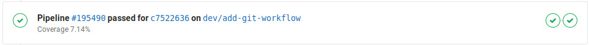

# Development workflow

#### 0. Pre-requisites

- Read carefully and accept the [Prospéro code of conduct](../CODE_OF_CONDUCT.md)
- Have a [Framagit](https://framagit.org/) account
- Install version **2.0** or later of [Git](https://git-scm.com/downloads)
- Read our [Git guidelines](git_guidelines.md)

#### 1. Request developer access to the project

Please [enable Two-Factor Authentication](https://framagit.org/profile/two_factor_auth) to your account.

[Go to the project's home page](https://framagit.org/lobster/prospero) and request developer accces by clicking on **Request access**.

You don't need to wait for your request to be accepted to proceed, but you won't be able to perform step 4 before having developer access garanteed.

#### 1 (alternative). Create your own fork

If you want to contribute punctually without requesting developer access to the project, [create your own fork of Prospéro](https://framagit.org/lobster/prospero/-/forks/new).

In this case, clone your fork's repository and skip the step 2.

#### 2. Clone repository

[Add your SSH key](https://framagit.org/profile/keys) to your account.

Clone Prospéro repository by running:

```sh
git clone git@framagit.org:lobster/prospero.git
cd prospero
```

#### 3. Create your local feature branch

Feature branches must **always** be created from **develop** branch, so right before creating a feature branch please do:

```sh
git checkout develop
git pull --rebase
```

Create your feature branch with `dev/` prefix.

```sh
git checkout -b dev/your-feature-name
```

_Example:_

```sh
git checkout -b dev/accounts-management
```

#### 4. Create your feature branch remotely

Push your newly created branch to the remote repository.

```sh
git push --set-upstream origin dev/your-feature-name
```

_Example:_

```sh
git push --set-upstream origin dev/accounts-management
```

_If you don't have internet connection at this moment or your developer access has not been accepted yet, you can perform step 5 before the step 4. The step 4 must be performed before the step 6._

#### 5. Perform your changes

Edit files and create [commits](https://git-scm.com/docs/git-commit) in your local feature branch.

You may need to [run Prospéro in the development environment](running_prospero_in_the_development_environment.md).

#### 6. Push your changes to the remote repository

Since your branch have already been created in the remote repository, you can push new local changes by running:

```sh
git push
```

#### 7. Create a merge request

When your changes [work perfectly on your local machine](running_prospero_in_the_development_environment.md), no code-style offenses are detected, all tests pass, and you have pushed all your local changes to the remote repository, you are able to [create a Merge Request](https://framagit.org/lobster/prospero/merge_requests/new).

- Select your feature branch as **source branch**
- Select **develop** as **target branch**
- Click on **Compare branches and continue**
- Add an explicit title and a complete description
- Click on **Submit merge request**

Wait for the pipeline to be executed for your branch, you should see something like the following at your merge request's page:


- Make sure the pipeline has passed
- Make sure your merge request doesn't decrease the [current code coverage](https://lobster.frama.io/prospero/coverage)

If your merge request respects the previous conditions, edit it and assign it to another team member for reviewing. Otherwise, repeat steps 5 and 6 until the merge request satisfies all required conditions.

#### 8. Wait for feedback

_The code review documentation will come soon..._

When everything is alright, your merge request will be merged. Congratulations!

## See also

- [Git guidelines](git_guidelines.md)
- [Version control](versioning_control.md)
- [Running Prospéro in the development environment](running_prospero_in_the_development_environment.md)
