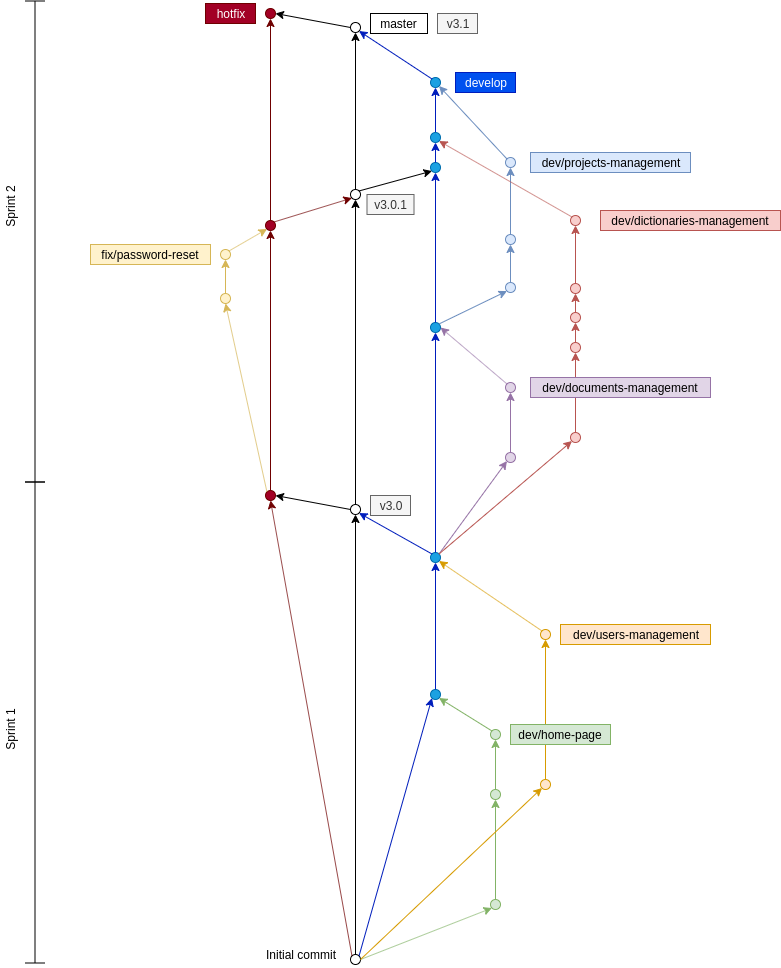

# Version control

## Overview

The following schema is a fictional example that illustrates the Prospéro version
control management:

This is the story told by this example:

#### Sprint 1

The Prospéro team planned the implementation of two initial features:

* Application home page
* Users management

At the end of the **sprint 1**, the release manager packaged the version **3.0**
including the two features.

#### Sprint 2

The Prospéro team planned the implementation of three new features:

* Document management
* Dictionaries management
* Projects management

During the **sprint 2**, an unexpected bug were detected in the current version:

* Users could not reset their own password

The development team quickly fixed the error, and the release manager packaged
a new version **3.0.1** including the fix. Although the document management
feature had already been developed at that moment, it was nottotally validated
so it couldn't be released yet.

At the end of the **sprint 2**, the release manager packaged the version **3.1**
including the three planned feature and the bugfix that were added during the
sprint.

## Branches

The main branches are:

**master** - the latest stable version.

**develop** - contains the newly developed features that have not been released
yet.

**hotfix** - contains the bugfixes applied between two stable versions.

### Feature branches

Includes a specific feature during all its development process, they have a
`dev/` prefix in their name.

### Bugfix branches

Includes a specific bugfix during all its development process, they have a
`fix/` prefix in their name.

### Release tags

Release tags have a `v` prefix in their name.

## Version names pattern

The Prospéro project uses the [Semantic Versioning](https://semver.org/spec/v2.0.0.html)
standard, our version names have the following pattern:

MAJOR.MINOR.PATCH

_Example: **3.0.1**_

### Major versions

A major version increment means a significant big evolution in the software.

### Minor versions

A minor version increase means a new public version with new features and
technical improvements.

### Patch versions

A patch version increase means a bugfix.
